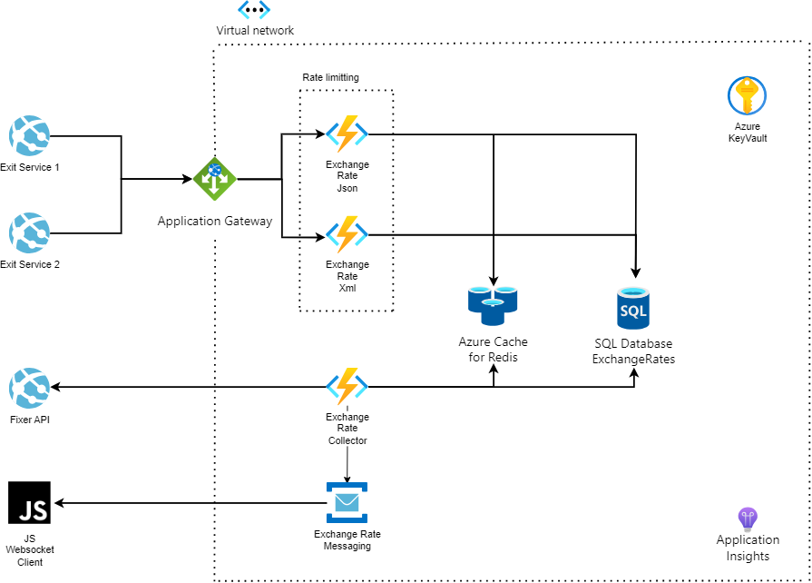

# ExchangeRates Overview

ExchangeRates is a serverless solution for fetching and distributing the latest exchange rate information in real time. It comes with out-of-the-box scalling based on incomming traffic with the ability to cache latest exchange rates in Redis. In addition it provides rate limitting capabilities based on a client ID to prevent API abuse.

**Key Components:**

- **Exit app services**: These are the external services which will consume our API's based on their client ID

- **Application Gateway**: An Azure Application Gateway is used as a secure entry point to the application. It handles SSL termination, routing, and load balancing, ensuring high availability and security.

- **Azure Cache for Redis**: Recent exchange rates are cached in Azure Cache for Redis, improving search performance and reducing database load.

- **Azure SQL Database**: Used to store the request history from all of the Exit app services as well as the history of the exchange rate changes

- **Azure Service Bus Topic**: The ExchangeRateCollector function publishes messages to an Azure Service Bus Topic. This decouples components and enables asynchronous communication.

- **Azure Functions**:
    - ExchangeRatesJson Function: Provides endpoints for fetching current data and the history of an exchange rate in JSON format.
    - ExchangeRatesXml Function:  Provides endpoints for fetching current data and the history of an exchange rate in XML format.
    - ExchangeRatesCollector Function: Responsible for fetching the latest exchange rates from the Fixer API based on a configuration schedule and then producing messages in the Messaging bus in order for them to consumed by the JS WS client.

- **Application Insights**: Application Insights is used for monitoring and gaining insights into the performance and usage of the e-commerce platform. It helps identify issues, troubleshoot bottlenecks, and optimize the system.

- **Virtual Network**: An Azure Virtual network to secure the communication between the different service

- **Azure Key Vault**: Provides a secure way for storing application secrets and consuming them in authorized services

